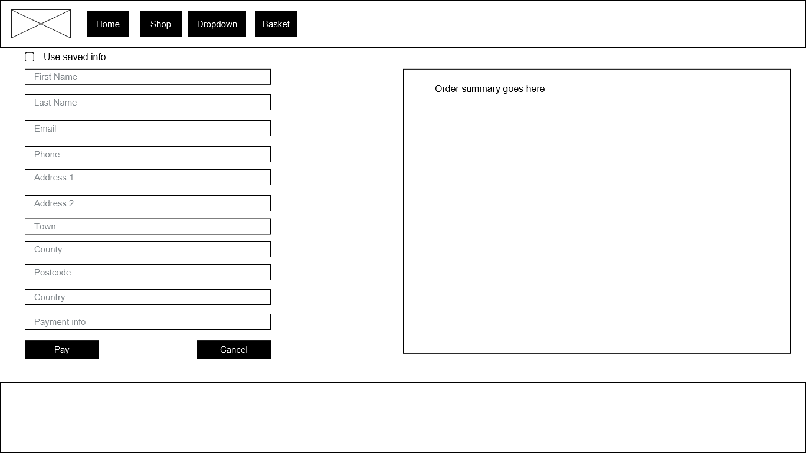
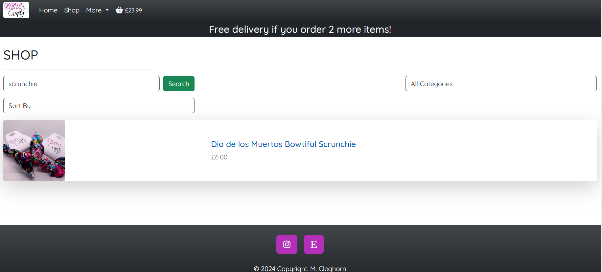
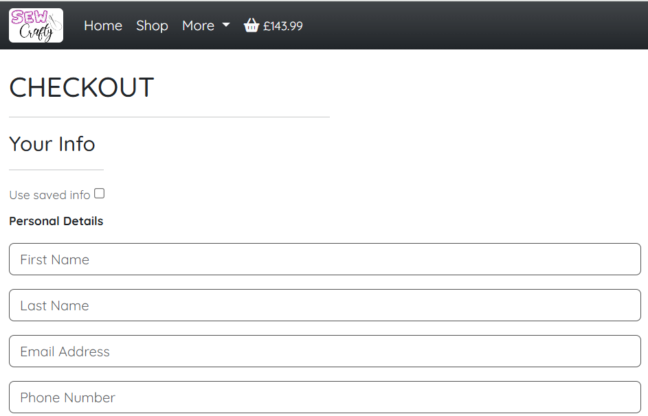

Sew Crafty is the website for my friend Ash's side hustle.

She makes beautiful & unique items out of yarn (mostly). 

Visit the deployed site [here](https://sew-crafty-cleg83-7e1cea4bde60.herokuapp.com)

<br>

## CONTENTS

* [Rationale](#rationale)
  * [Project Introduction](#project-introduction)
  * [Motivation and Inspiration](#motivation-and-inspiration)
  * [Background Information](#background-information)
  * [Project Scope and Limitations](#project-scope-and-limitations)
    * [Scope](#scope)
    * [Limitations](#limitations)
  * [Problem Statement](#problem-statement)
  * [Proposed Solution](#proposed-solution)
  * [Benefits and Advantages](#benefits-and-advantages)
  * [Future Versions](#future-versions)
  * [Summary](#summary)

* [User Stories](#user-stories)

* [Design](#design)
  * [Color Scheme](#color-scheme)
  * [Typography](#typography)
  * [Wireframes](#wireframes)

* [Database](#database)
  * [Database Schema](#database-schema)
    * [Product model](#database-technologies)
    * [Category model](#category-model)
    * [Order Model](#order-model)
    * [Line Item model](#line-item-model)
    * [User Profile model](#user-profile-model)
    * [Event model](#event-model)

* [Features](#features)
  * [Favicon](#favicon)
  * [Navbar](#navbar)
  * [Footer](#footer)
  * [Home Page](#home-page)
  * [Delivery Banner](#delivery-banner)
  * [Shop](#shop)
  * [Product Page](#product-page)
  * [Basket](#basket) 
  * [Checkout](#checkout)
  * [Events](#events)
  * [User Profile](#user-profile)
  * [Admin](#admin)


* [Accessibility](#accessibility)
  * [Accessibility Overview](#accessibility-overview)
  * [Accessibility Standards](#accessibility-standards)
  * [Key Accessibility Features](#key-accessibility-features)

* [Technologies](#technologies)
  * [Languages](#languages)
  * [Frameworks, Libraries and Programs](#frameworks-libraries-and-programs)

* [Deployment and Development](#deployment-and-development)
  * [Deployment](#deployment)
  * [Local Development](#local-development)
    * [Extensions required](#extensions-required)
    * [How to Fork](#how-to-fork)
    * [How to Clone](#how-to-clone)

* [Testing](#testing)
  * [W3C](#w3c)
    * [CSS](#css)
    * [HTML](#html)
  * [Lighthouse](#lighthouse)
  * [JSHint](#jshint)

* [Bugs](#bugs)
  
* [Credits](#credits)

# Rationale

## Project Introduction

This project is an e-commerce platform designed for a small business specialising in handcrafted, unique yarn-based products. The website provides a seamless shopping experience, allowing customers to browse and purchase items while also keeping them informed about upcoming events where the shop owner will be selling products in person.

## Motivation and Inspiration

The inspiration for this project comes from the increasing demand for small business owners to establish an online presence. Handmade and artisanal products have a dedicated market, but many small business owners struggle with the technical aspects of setting up an e-commerce site. This project aims to bridge that gap by providing an intuitive and user-friendly platform tailored to the needs of a craft-based business.

## Background Information

In today's digital economy, an online store is essential for small businesses to grow and reach wider audiences. While many sellers rely on platforms like Etsy, having an independent store allows for greater control over branding, pricing, and customer engagement. Additionally, integrating an events section helps small business owners connect with local buyers who prefer to shop in person.

## Project Scope and Limitations

### Scope

  * E-commerce Functionality: Customers can browse products, add them to their basket, and complete purchases using a secure checkout process.
  * User Profiles: Returning customers can create accounts to save personal details, making checkout faster and order tracking more convenient.
  * Event Listings: A dedicated events page informs customers about upcoming markets, craft fairs, or exhibitions where the business will have a stall.
  * Product Management: The shop owner can manage inventory, update product listings, and mark items as out of stock.

### Limitations

 * Single Vendor: The platform is designed for a single business and does not support multi-vendor functionality.
 * Limited Payment Methods: Initially, only a selected number of payment gateways will be integrated.
 * Basic Order Tracking: While customers can view their orders, advanced logistics or real-time tracking are not included in this version.

## Problem Statement

Small businesses that specialize in handcrafted products often struggle with setting up an online store that meets their needs without requiring extensive technical knowledge. Existing platforms may be costly, restrictive, or lack the ability to integrate offline sales events, which are crucial for many artisans and craft sellers.

## Proposed Solution

This project provides a custom e-commerce solution with an intuitive interface, streamlined checkout, and an integrated event listing feature. By combining online sales with an events section, the platform ensures customers can both shop online and discover in-person opportunities to support the business.

## Benefits and Advantages

  * Increased Reach: Customers can purchase products anytime, even if they cannot attend in-person events.
  * Enhanced User Experience: Registered users enjoy a faster checkout process and order history tracking.
  *  Brand Control: Unlike third-party platforms, this independent store allows full control over branding, pricing, and customer interaction.
  * Event Promotion: The events page helps drive foot traffic to in-person sales opportunities, fostering community engagement and repeat customers.
  * Scalability: The platform can grow with the business, allowing for future feature expansions like discount codes, gift cards, or additional payment options.

## Future Versions

Future updates may include:

  * Wishlist Functionality: Allowing users to save products for future purchases.
  * Expanded Payment Options: Integration with additional payment providers.
  * Reviews and Ratings: Enabling customers to leave feedback on purchased products.
  * Enhanced Order Tracking: Providing more detailed shipment tracking options.
  * Newsletter Sign-Up: Allowing customers to subscribe for updates on new products and upcoming events.

## Summary

This e-commerce platform is designed to support a small business selling beautiful, handcrafted products. By combining a custom online store with an event promotion feature, the website enhances both digital and in-person sales. With scalability in mind, the project provides a solid foundation for future growth, ensuring the business can continue to expand its reach and customer base.

# User Stories

## Guest Users:

1: As a guest user, I want to browse available items and purchase them without creating an account so that I can shop quickly and easily.

* Acceptance Criteria:
* * I can add items to my basket without signing in.
* * I can proceed to checkout and enter my details manually.
* * I can complete my purchase without needing to register.

<br>

2: As a guest user, I want to casually browse the site to look at products and view upcoming events so that I can see what's available before making a decision.

* Acceptance Criteria:
* * I can access product pages without logging in.
* * I can view event details (dates, descriptions, locations & buy ticket links).
* * I can navigate easily between different categories of products.

<br>

3: As a guest user, I want to be able to contact the shop owner if I have any questions before purchasing, so that I can make an informed decision.

* Acceptance Criteria:
* * I can find the shop’s contact email in the footer of the website.
* * I can expect a response within a reasonable time frame.

<br>
<hr>

## Authenticated Users:

1: As a registered user, I want to view my order history so that I can keep track of past purchases.

* Acceptance Criteria:
* * I can access a "My Orders" section in my profile.
* * I can see a list of all my past orders, including order date, and total cost.
* * I can click on an order to see more details, including items purchased and shipping info.

<br> 

2: As a registered user, I want to save my address details so that I can check out faster for future purchases.

* Acceptance Criteria:
* * I can enter and save my shipping address in my profile.
* * When checking out, I can choose my saved address instead of entering it manually.
* * I can update or delete my saved address if needed.

<br> 

3: As a registered user, I want to an email notification about my order status so that I stay informed about my purchase.

* Acceptance Criteria:
* * I receive an order confirmation email after checkout.
* * I can unsubscribe from email notifications if I don’t want them.

<br>
<hr>

## Admin / Shop Owner:

1: As the shop owner, I want to manage products easily so that I can update my inventory.

* Acceptance Criteria:
* * I can add new products through the admin dashboard.
* * I can update product descriptions, images, and prices.
* * I can mark products as "out of stock" or remove / mark as permanently unavailable if necessary.

<br>

2: As the shop owner, I want to manage customer orders so that I can fulfill purchases efficiently.

* Acceptance Criteria:
* * I can view all incoming orders.
* * Customers are notified when their order is confirmed. 

<br>

3: As the shop owner, I want to manage upcoming events so that customers can stay informed about workshops or sales.

* Acceptance Criteria:
* * I can create, edit, or delete events from the admin dashboard or the front end. 
* * Events are displayed clearly on the website.
* * Customers can see event details, including dates, descriptions and buy ticket links where applicable. 

<br>

# Design

## Color Scheme


As all pages have a white background, the other colors used needed to contrast well and also provide consistency across pages.

The defining color of the website is a lovely Steel Pink: #B32FBA. This matches the shade in the logo image found in the navbar, favicon, home page image and all of the back buttons on the site. 

Most of the colors mirror Bootstrap's pre-defined colors:

#212529 matches Bootrstrap Dark
#198754 matches Bootrstrap Success
#DC3545 matches Bootrstrap Danger 


## Typography

Simplicity was the key here so I opted for one font to be used throughout the site and that font is the Google Font, [Quicksand](https://fonts.google.com/specimen/Quicksand)


## Wireframes

Simple wireframes were created for the crucial pages to give me an idea of how I wanted to lay the site out.

### Home page wireframe


### Shop wireframe


### Basket wireframe


### Checkout wireframe



### Events wireframe 


# Database

## Database Technologies

The database for this project is powered by PostgreSQL, a powerful, open-source relational database management system (RDBMS). PostgreSQL was chosen due to its robustness, scalability, and ability to handle complex queries and relationships between tables. 

In the development environment, the project uses a local PostgreSQL database, and in the production environment, it is deployed on Heroku Postgres, ensuring seamless integration with the web application.

<br> 

## Database Schema

The database for this project is designed to manage products, categories, user profiles, orders, and events. It ensures structured relationships between customers, their orders, and available products.

### Product model

#### Purpose: 

Stores information about products available for purchase.

#### Columns:

* id: Integer, primary key, auto-increment.
* category: Foreign key, references id in the Category table (nullable). Links a product to its category.
* sku: String (100), optional unique product identifier.
* name: String (300), not null. Stores the product name.
* description: Text, not null. Stores the product description.
* price: Decimal (6,2), not null. Stores the product price.
* image_url: URL, optional. Stores an external image link.
* image: ImageField, not null. Stores a product image.
* in_stock: Boolean, default True. Determines if the product is available.
* permanently_unavailable: Boolean, default False. Marks product as discontinued.

<hr>

### Category model

#### Purpose: 

Organizes products into categories.

#### Columns:

* id: Integer, primary key, auto-increment.
* name: String (300), unique, not null. Stores the category name.
* display_name: String (300), optional. Stores a user-friendly category name.

#### Relationships:

* One-to-many relationship with the Product table. Each category can have multiple products.

<hr>

### Order Model

#### Purpose: 

Stores customer orders, including order totals and user details.

#### Columns:

* id: Integer, primary key, auto-increment.
* order_number: String (32), unique, auto-generated.
* user_profile: Foreign key, references id in UserProfile (nullable). Links orders to users.
* first_name, last_name, email, phone_number: Customer details.
* address_1, address_2, town, county, postcode, country: Shipping details.
* date: DateTime, auto-generated. Stores the order creation date.
* item_count: Integer, default 0. Stores total items in the order.
* delivery_fee: Decimal (6,2), default 0. Stores shipping costs.
* order_total: Decimal (10,2), default 0. Stores the subtotal.
* grand_total: Decimal (10,2), default 0. Stores the final order total (subtotal + delivery fee).
* original_basket: Text, stores a JSON representation of the original basket.
* stripe_pid: String, stores Stripe transaction ID.

#### Methods:

* _create_order_number(): Generates a unique order number.
* update_total(): Recalculates order totals and delivery fees.

#### Relationships:

One-to-many relationship with LineItem. Each order contains multiple items.

<hr>

### Line Item model

#### Purpose: 

Stores individual products within an order.

#### Columns:

* id: Integer, primary key, auto-increment.
* order: Foreign key, references id in Order. Links line items to an order.
* shop_item: Foreign key, references id in Product (nullable). Links a product to a line item.
* product_name: String (300), not null. Stores the product name.
* product_price: Decimal (6,2), not null. Stores the product price.
* quantity: Integer, default 0. Stores item quantity.
* item_total: Decimal (6,2), auto-calculated. Stores the total price for the item.

#### Methods:

* save(): Updates item_total based on quantity and product_price.

<hr>

### User Profile model

#### Purpose: 

Stores user information for order history and saved addresses.

#### Columns:

* id: Integer, primary key, auto-increment.
* user: One-to-one relationship with Django's User model. Links the profile to an authenticated user.
* default_first_name, default_last_name, default_email, default_phone_number: Optional user details.
* default_address_1, default_address_2, default_town, default_county, default_postcode, default_country: Optional saved shipping details.

#### Methods:

* create_or_update_user_profile(): Automatically creates or updates a user profile when a user is created.

#### Relationships:

* One-to-many relationship with Order. A user can have multiple past orders.

<hr>

### Event model

#### Purpose: 

Stores information about store events.

#### Columns:

* id: Integer, primary key, auto-increment.
* name: String (600), not null. Stores event name.
* start_date, end_date: DateFields, not null. Stores event duration.
* start_time, end_time: TimeFields, optional. Stores event schedule.
* description: Text, not null. Stores event details.
* location: String (600), not null. Stores event venue.
* image_url: URL, optional. Stores an external event image.
* image: ImageField, not null. Stores event image.
* ticket_required: Boolean, default False. Determines if tickets are needed.
* ticket_url: URL, optional. Stores a ticket purchase link.

<hr>

### Relationships Summary

* Category ↔ Product: One-to-many. Each category contains multiple products.
* UserProfile ↔ Order: One-to-many. A user can place multiple orders.
* Order ↔ LineItem: One-to-many. Each order consists of multiple line items.
* Product ↔ LineItem: Many-to-one. A product can appear in multiple orders.

### Benefits of the Schema

* Scalability: Designed to handle many users, products, and orders efficiently.
* Normalization: Prevents data redundancy by separating products, orders, and users.
* Flexibility: Allows easy extension (e.g., adding product variations or order statuses).

<hr>

# Features

## Favicon

I opted to use the logo of the store for the favicon.


## Navbar

I wanted to navbar to be very simple and intuitive.

I opted to include search bars on the relevant pages rather than clutter the navbar.

The options in the more dropdown will vary, depending on whether a user is a guest user:


Authenticated user:


Or superuser:


## Footer

I used a very streamlined footer that contains links to the only other external websites the business uses and also included my GitHub link (as I don't yet have a website I can link to). 


The icons utilise the same colour as the logo and all back buttons throughout the site.


## Home page

I kept it very simple, only showcasing the logo and providing buttons to navigate to the shop and events pages.


## Delivery banner

The delivery banner only appears on relevant pages (shop, product and basket) and will update dynamically based on how many items are in the basket. 


## Shop

There are so many great online shop layouts to take inspiration from but I wanted to keep it as sparse as possible while still including all the key info relating to a product (image, name & price).


As there are not that many products available, it made more sense for each product to appear in it's own column.

The search bar searches items in the shop and filters the results accordingly. 



The category dropdown filters the products to only show products belonging to that category.


The sort function sorts as expected and also includes the category filter so if a category is selected, the sorting function only sorts products within that category. 


## Product page

Again, I wanted to keep this simple and uncluttered so there is an image, name, short description, price and quantity selector, as well as add to basket and continue shopping buttons.


If the product is out of stock then the price and add to basket buttons are hidden.


## Basket

This needed to contain all of the obvious functionality: update quantity of an item and remove the item from the basket. As you can see, the delivery banner updates dynamically when the basket is updated (when the user goes above or below the item threshold for free delivery).


There is also a handy summary of basket contents and the standard buttons to proceed to checkout or continue shopping. 

## Checkout

What fun it was creating this. Who doesn't love Stripe and it's a-synchronicities?

So the checkout flow needed to be obvious, uncluttered (are you spotting a minimalist theme here?) and more importantly, functional.

If the user is authenticated then they have an option to use the address that is saved to their profile.



Upon checking the box, the form is populated with the saved info. 


If the user is not authenticated then there is a link to create an account or login (the session stores the basket contents so the basket is not cleared upon creating an account or logging in).


If any required fields are not completed, the user is prompted to complete them before they can continue checking out. 


Upon successful checkout, the success page loads which confirms the order and a confirmation email is sent (the email mirrors the appearance of the checkout success page).


## Events

As a lot of business is generated by setting up stalls at various events throughout the country, it made sense to include the event information and ticket links where applicable. 

The list view also contains a search bar that will only search events and display the filtered results. 


## User Profile

The profile page includes a form to save an address (which can be used for faster checkout).


The order history contains links for each order so the user can view the details of each successful order/


## Admin

### Forms

Admin user are able to create and edit events, products & categories through the front end. All forms use crispy form formatting.


The editing forms are pre-populated with the event details:


<hr>

# Technologies

## Languages

* Python
* HTML
* JavaScript
* CSS

### Frameworks, Libraries and Programs

* Django: A high-level Python web framework that encourages rapid development and clean, pragmatic design. It powers the backend of the app.
* Django Allauth: A highly customizable authentication library for Django, used for handling user authentication, registration, and social logins.
* Django Crispy Forms: A Django app that helps render forms with Bootstrap styles easily, improving form UI/UX.
* Django Storages: A collection of custom storage backends for Django, which allows the application to interact with various cloud storage services (like AWS S3).
* Django Countries: A Django application to store and access country names and related data in a Django model.
* Gunicorn: A WSGI HTTP server for Python web applications, used to serve the Django app in production.
* Pillow: A powerful Python imaging library used for image processing tasks in Django, such as resizing or editing images before uploading.
* psycopg2: A PostgreSQL adapter for Python, used to connect Django to a PostgreSQL database.
* Stripe: A popular payment processing API, used to handle online payments securely.
* boto3: The Amazon Web Services (AWS) SDK for Python, used to interact with AWS services, including S3 for file storage.
* botocore: The low-level core functionality for AWS, supporting boto3 in performing AWS tasks such as file uploads.
* s3transfer: A library that facilitates the transfer of files to and from S3, enhancing the upload/download process.
* dj-database-url: A utility that helps configure database connections using URLs, commonly used for Heroku deployments.
* jmespath: A query language for JSON, used internally by the AWS SDK (boto3) for parsing and filtering JSON data.
* oauthlib: A generic and reusable Python library for implementing OAuth providers and consumers, useful for OAuth-based authentication.
* PyJWT: A Python library to work with JSON Web Tokens (JWTs), often used for handling user sessions and authentication tokens.
* requests-oauthlib: A library that adds OAuth support to Python's requests library, used for interacting with OAuth APIs.
* sqlparse: A non-validating SQL parser for Python, commonly used for SQL query formatting and analysis.
* asgiref: A reference implementation of ASGI (Asynchronous Server Gateway Interface), required for Django Channels to work with asynchronous functionality.
* Git: Version control used to manage the project codebase.
* GitHub: The repository hosting service used for version control and will be used for future collaboration.
* Heroku: The cloud platform where the app is deployed (more on deployment below).
* Lucidchart: Used to create the Entity Relationship Diagram (ERD) to visualise the database structure.
* Justinmid: USed to create the wireframes to help visualise this application. 


# Deployment and Development

## Deployment

This application was deployed to Heroku with AWS S3 integration for static and media file storage. 

Use the following steps:

1. Log in to Heroku or create a new account at [Heroku](https://heroku.com).

2. Create a new Heroku app through the Heroku Dashboard:

    * In the Heroku dashboard, click New > Create New App.
    * Choose a unique name for your app and select a region.

3. Add PostgreSQL:

    * In the app dashboard, go to the Resources tab.
    * In the "Add-ons" section, search for Heroku Postgres and select the Hobby Dev - Free plan.

4. Set up AWS for static and media file storage:

    * Log in to AWS or create a new account at [AWS](https://aws.amazon.com/).

    * Create an S3 Bucket:

    * To create a new bucket:
      * Click Create bucket.
      * Choose a unique name (e.g., myapp-static-files).
      * Select the region (e.g., eu-north-1).
      * Enable public access (optional but required for static files).
      * Leave the rest as defaults and create the bucket.

    * Create a Bucket Policy:
      * In the S3 Console, select the bucket you created.
      * Go to the Permissions tab, then click Bucket Policy.
      * Add the following policy to allow the IAM user to perform necessary actions on the S3 bucket:
        ```json
        {
          "Version": "2012-10-17",
          "Statement": [
            {
              "Effect": "Allow",
              "Action": [
                "s3:PutObject",
                "s3:GetObject",
                "s3:ListBucket"
              ],
              "Resource": [
                "arn:aws:s3:::YOUR_BUCKET_NAME",
                "arn:aws:s3:::YOUR_BUCKET_NAME/*"
              ]
            }
          ]
        }
        ```
      * Replace YOUR_BUCKET_NAME with the actual name of your S3 bucket.
      * Click Save to apply the policy.

    * Create an IAM User Group:
      * Go to the IAM Console in AWS.
      * In the sidebar, click User Groups, then click Create Group.
      * Choose a name for the group (e.g., S3-Access-Group).
      * Attach a policy to the group:
        * Click Attach Policies Directly.
        * Select the AmazonS3FullAccess policy, or create a custom policy.
        * Click Create Group.

    * Create an IAM User:
      * Attach a policy to the group:
        * Click Attach Policies Directly.
        * Select the AmazonS3FullAccess policy, or create a custom policy (using the JSON from earlier if needed).
        * Click Create Group.


4. Set up environment variables:

    * In the Settings tab, click Reveal Config Vars under Config Vars.
    * Add the following keys and values:
      * AWS_ACCESS_KEY_ID: Your IAM user access key. 
      * AWS_S3_REGION_NAME: eg eu-north-1
      * AWS_SECRET_ACCESS_KEY: Your IAM user secret access key
      * AWS_STORAGE_BUCKET_NAME: Name of your S3 bucket
      * DATABASE_URL: Add your PostgresSQL DB or use the one that is automatically created when PostgreSQL is added.
      * DEBUG: Set this to False for production.
      * DEFAULT_FROM_EMAIL: Whatever email address you wish to use
      * EMAIL_HOST_PASSWORD: Your email app password (if using gmail)
      * EMAIL_HOST_USER: Whatever email address you wish to use
      * SECRET_KEY: Your secret key for the Django app.
      * STRIPE_ENDPOINT_SECRET: Your Stripe webhook secret key
      * STRIPE_PUBLIC: Your Stripe public key
      * STRIPE_SECRET: Your Stripe secret key
      * USE_AWS: True (in production).


5. Connect your GitHub repository:

    * In the Deploy tab, scroll down to Deployment Method and select GitHub.
    * Search for your repository and connect it.
    * Enable Automatic Deploys (optional) or manually deploy the branch.

6. Run migrations:

    * In the More dropdown at the top-right corner of your app dashboard, select Run Console.
    * Type the following to apply database migrations:
      * `python manage.py migrate`

7. Run collectstatic:
    * Make sure static files are uploaded to your S3 bucket:
      * `python manage.py collectstatic`

8. Open the app: Once the deployment is successful, you can view your live app by clicking Open App at the top-right corner of the dashboard.

<br>

## Local Development

### Extensions required

* Django: The web framework used to build the app.
* Django Allauth: For handling user authentication and social logins.
* Django Crispy Forms: For styling Django forms with Bootstrap.
* Django Storages: For interacting with AWS S3 for static and media files.
* Gunicorn: A WSGI HTTP server for running the app in production.
* Pillow: For image processing tasks (resizing, etc.).
* psycopg2: PostgreSQL adapter for connecting to the database.
* stripe: For payment processing.
* boto3: For interacting with AWS services (S3).
* botocore: Core functionality for AWS services (needed by boto3).
* s3transfer: Facilitates the transfer of files to and from S3.

You can install these dependencies via pip:
* `pip install -r requirements.txt`


### How to Fork

If you want to contribute to this project or create a personal version, you can fork the repository on GitHub (I will welcome any feedback, improvements or help in general really).

1. Navigate to the repository on GitHub.
2. Click the Fork button on the upper-right corner of the repository page.
3. The project will be copied to your GitHub account, and you can freely experiment with the code.


### How to Clone

To make a local copy of this repository:

1. In the GitHub repository, click on the Code button.
2. Copy the HTTPS URL provided.
3. Open your terminal and run the following command:

    * `git clone https://github.com/your-username/your-repo-name.git`

4. Navigate into the cloned directory and run the following command:

    * `cd your-repo-name`

You now have a local copy of the project and can follow the Local Development steps to get started.

<br>

# Testing

For detailed testing, see <a href="https://github.com/Cleg83/sew_crafty_project/blob/main/testing.md" target="_blank">testing.md</a>

## W3C

### CSS


### HTML

#### Home Page

#### Shop

#### Basket

#### Checkout

#### Checkout Success

#### Events

#### User Profile

#### Order Info (Completed Order)

#### Shop & Event Management

#### Allauth templates

## Lighthouse 

## JSHint

The only JS files are in the checkout app, one for Stripe and one for retrieving profile info to populate the checkout form.


## Bugs

# Credits